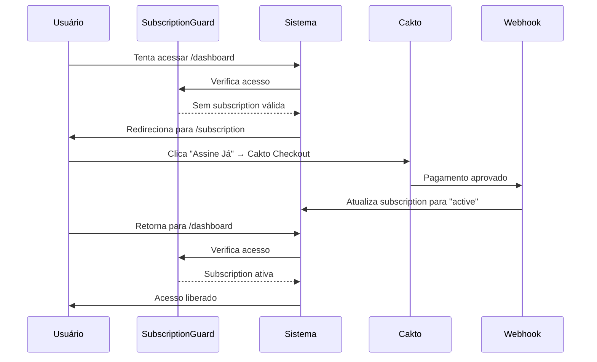

# Sistema de Guard de Assinatura

## Visão Geral

O sistema de guard controla o acesso às páginas da aplicação baseado no status da assinatura do usuário, garantindo que apenas usuários com assinaturas válidas possam acessar as funcionalidades do sistema.

## Funcionamento

### Componentes Principais

1. **SubscriptionGuard** - Componente que envolve as rotas protegidas
2. **useSubscription** - Hook que gerencia o estado da assinatura
3. **Configuração de Rotas** - Aplicação do guard nas rotas do App.tsx

### Regras de Acesso

#### ✅ Acesso Permitido
- **Status 'active'**: Assinatura ativa, acesso completo
- **Status 'trial' com data válida**: Trial ainda não expirado
- **Rotas sempre acessíveis**: `/subscription`, `/subscription/success`, `/subscription/cancel`

#### ❌ Acesso Negado (Redirecionamento para /subscription)
- **Sem assinatura**: Usuário não possui registro na tabela subscriptions
- **Status 'suspended'**: Assinatura suspensa por falta de pagamento
- **Status 'cancelled'**: Assinatura cancelada
- **Trial expirado**: Status 'trial' com current_period_end < now()

## Implementação Técnica

### Hook useSubscription

```typescript
const {
  subscription,      // Dados da assinatura
  isLoading,         // Estado de carregamento
  isActiveOrTrial,   // true se pode acessar o sistema
  daysLeft,          // Dias restantes do período atual
  status,            // Status atual ('active', 'trial', 'suspended', etc.)
  needsUpgrade       // true se precisa fazer upgrade
} = useSubscription();
```

### Fluxo de Verificação

1. **Loading State**: Mostra spinner enquanto verifica auth + subscription
2. **Path Check**: Libera imediatamente rotas de subscription
3. **Auth Check**: Delega para sistema de auth se usuário não autenticado
4. **Subscription Check**: 
   - Se não há subscription → redireciona para /subscription
   - Se !isActiveOrTrial → redireciona para /subscription
   - Se tudo ok → renderiza conteúdo

### Integração com Cakto



## Rotas Protegidas

### Com Guard de Assinatura
- `/` (Dashboard principal)
- `/dashboard`
- `/crm`
- `/financeiro`
- `/tarefas`
- `/clientes`
- `/contratos`
- `/cs`
- `/sucesso-cliente`
- `/configuracoes`
- `/admin`

### Sempre Acessíveis
- `/subscription` (Página de planos)
- `/subscription/success` (Retorno de pagamento aprovado)
- `/subscription/cancel` (Retorno de pagamento cancelado)

## Estados de Subscription

| Status | Descrição | Acesso | Ação |
|--------|-----------|---------|------|
| `null` | Sem subscription | ❌ | Criar subscription |
| `trial` (válido) | Trial ativo | ✅ | Continuar usando |
| `trial` (expirado) | Trial expirado | ❌ | Fazer upgrade |
| `active` | Assinatura ativa | ✅ | Continuar usando |
| `suspended` | Suspensa por pagamento | ❌ | Regularizar pagamento |
| `cancelled` | Cancelada | ❌ | Nova assinatura |

## Otimizações de Performance

### React Query Cache
- Cache por `empresa_id` evita requisições desnecessárias
- Auto-refetch quando necessário
- Sincronização entre abas/componentes

### Conditional Rendering
- Early return para rotas sempre permitidas
- Verificações em ordem de performance
- Loading states não bloqueantes

### Lazy Loading
- Guard só executa lógica quando necessário
- Dados carregados sob demanda
- Estados intermediários tratados

## Segurança

### Prevenção de Bypass
- ✅ Guard executa em toda navegação
- ✅ Verificação server-side via RLS policies
- ✅ Dados sempre atualizados via React Query
- ✅ Manipulação de URL protegida

### Auditoria
- Estados de subscription logados
- Tentativas de acesso registradas
- Mudanças de status auditadas

## Cenários de Teste

### 1. Usuário Novo
```
Login → Sem subscription → /subscription → Assinar → Acesso liberado
```

### 2. Trial Expirado
```
Login → Trial expirado → /subscription → Renovar → Acesso liberado
```

### 3. Pagamento Suspenso
```
Login → Suspended → /subscription → Regularizar → Acesso liberado
```

### 4. Usuário Ativo
```
Login → Active subscription → Acesso direto ao sistema
```

## Troubleshooting

### Guard não funciona
- Verificar se SubscriptionGuard envolve a rota
- Conferir dados na tabela subscriptions
- Validar RLS policies

### Loops de redirecionamento
- Verificar se rotas de subscription estão na whitelist
- Conferir estados de loading
- Validar lógica de isActiveOrTrial

### Performance lenta
- Otimizar queries no useSubscription
- Verificar cache do React Query
- Reduzir re-renders desnecessários